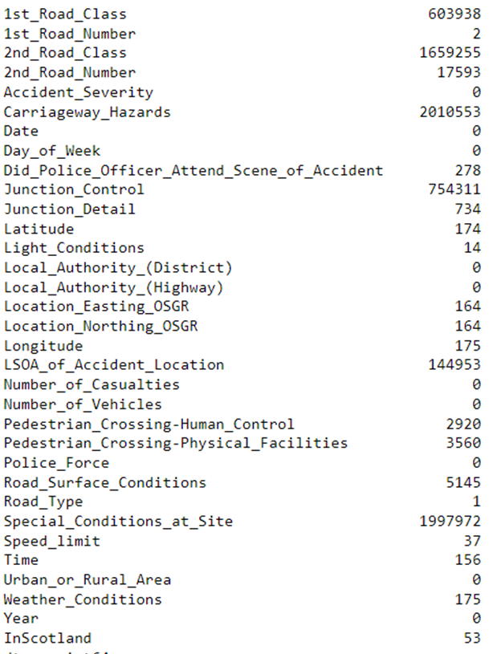
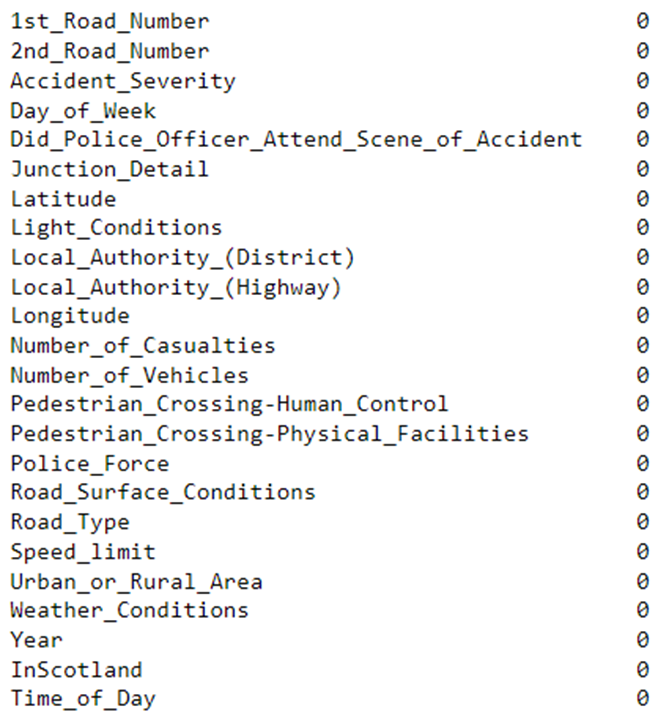
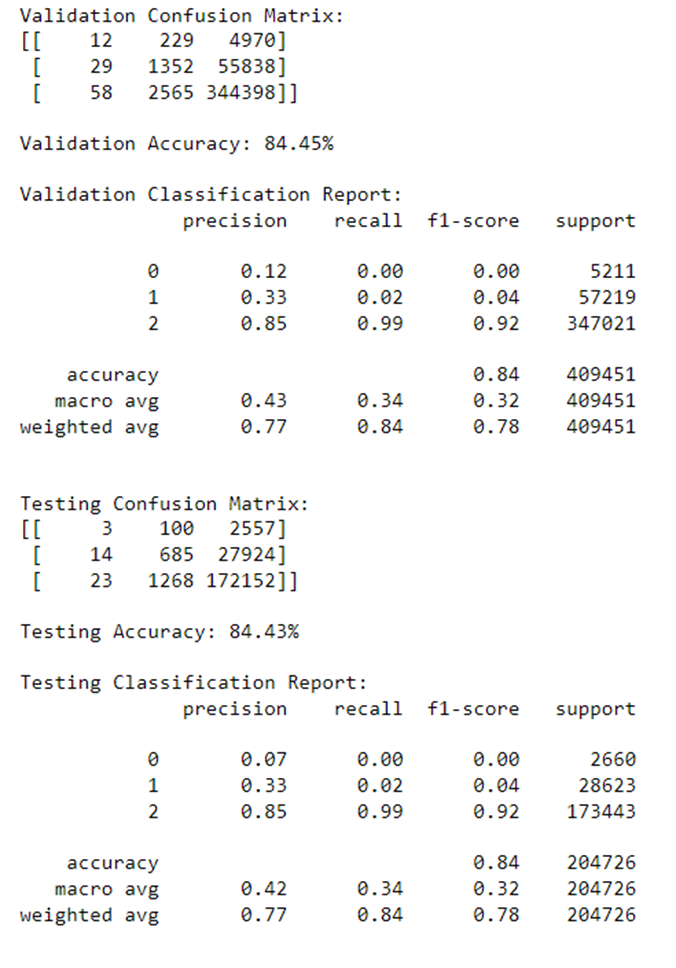
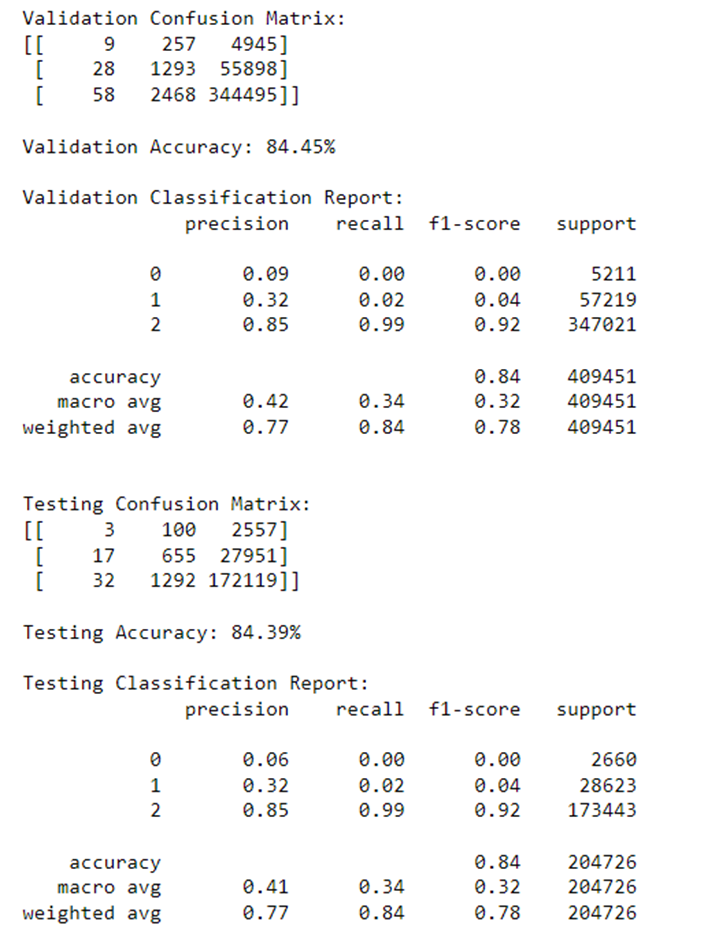
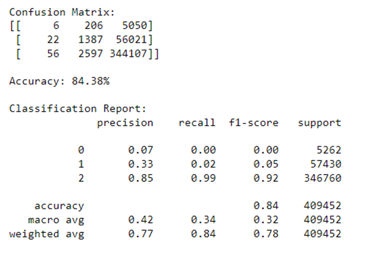
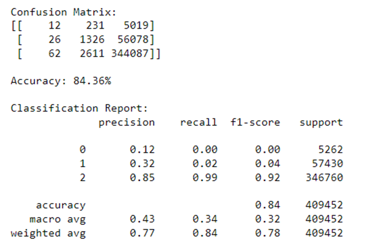
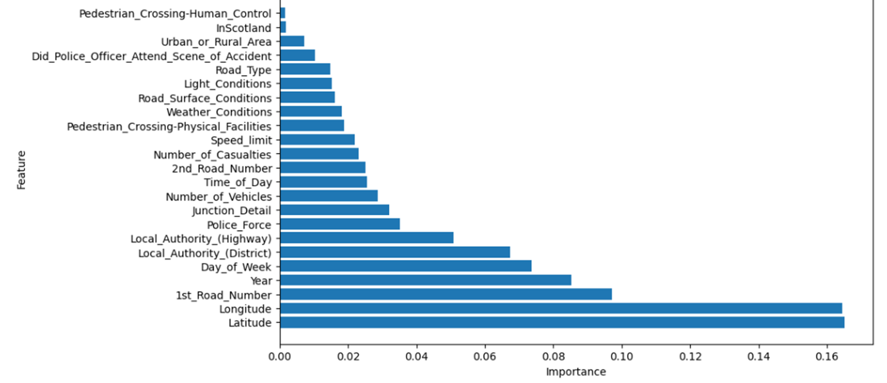
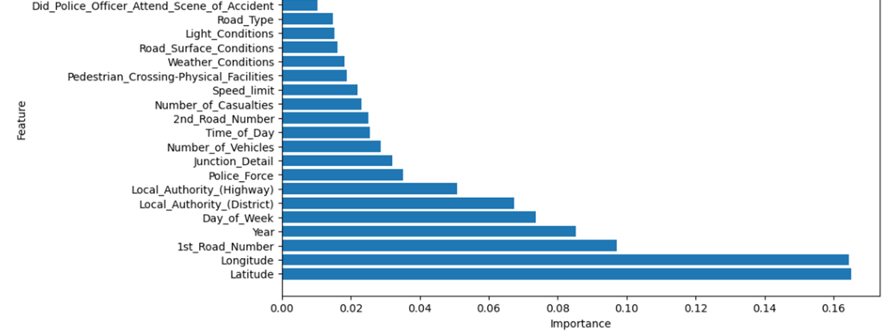
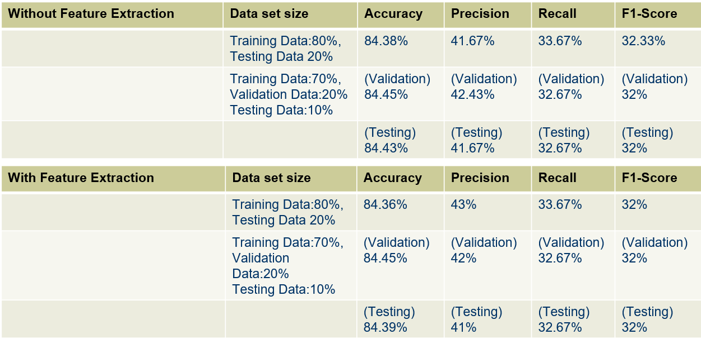
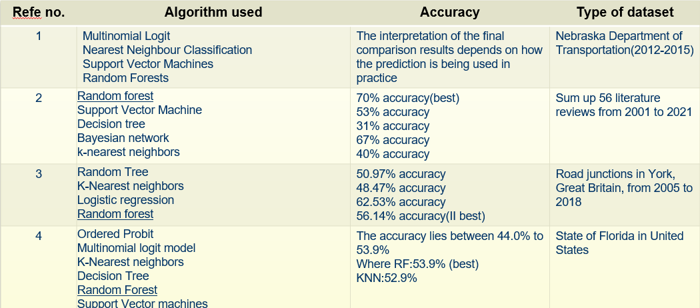

# 🚗 Accident Fatality Prediction

 
 

## 📌 About the Project
  
In an era where road safety is paramount, there is a drastic need to lower traffic accidents and fatalities. This project leverages the **Accident Information** dataset from Kaggle, detailing previous UK crashes, to develop highly reliable predictive models for forecasting crash fatalities.

The primary goals of this research include:
- Analyzing large amounts of traffic accident data.
- Applying robust Data Filtering and Preprocessing steps.
- Developing and evaluating Machine Learning prediction models (specifically Random Forest and Logistic Regression) to assess their accuracy and efficiency.

---

## 📊 Dataset & Preprocessing

The project uses the `Accident_Information.csv` dataset. Significant efforts were directed towards cleaning and preparing the data for optimal model performance:

1. **Data Cleaning**:
   - Removed identifiers such as `Accident_Index`.
   - Replaced redundant or missing entry markers (`Unclassified`, `Data missing or out of range`) with `NaN` values.
   - Dropped unnecessary columns for better feature quality (e.g., `1st_Road_Class`, `2nd_Road_Class`, `Location_Easting_OSGR`, etc.).
2. **Feature Engineering**:
   - Transformed `Date` and `Time` features into a categorized `Time_of_Day` column (`Morning`, `Evening`, `Night`).
   - Categorical variables were label-encoded for machine-learning compatibility.
3. **Handling Missing Values**:
   - Implemented two different imputation strategies to compare results:
     - Filling `NaN` values with the **Mean** (floor divided) of the respective column.
     - Filling `NaN` values with the **Mode** of the respective column.

### Data Analysis Overview
**Before Preprocessing:**

**After Preprocessing:**

---

## 🏗️ Model Training & Evaluation

The target variable for our predictive models is `Accident_Severity`. Two primary models were evaluated: **Random Forest Classifier** and **Logistic Regression**.

### 1. Models with Mean Filled Data

#### Without Feature Extraction
* **Random Forest** (Split: 70% Train, 20% Validation, 10% Test)
  * Validation Accuracy: **84.45%**
  * Testing Accuracy: **84.41%**
* **Logistic Regression** (Split: 80% Train, 20% Test)
  * Testing Accuracy: **84.68%**

#### With Feature Extraction
* **Random Forest** (Split: 70% Train, 20% Validation, 10% Test)
  * Validation Accuracy: **84.45%**
  * Testing Accuracy: **84.39%**

### 2. Models with Mode Filled Data

#### Without Feature Extraction
* **Random Forest** (Split: 80% Train, 20% Test)
  * Testing Accuracy: **84.38%**
* **Logistic Regression** (Split: 70% Train, 30% Test)
  * Testing Accuracy: **84.74%**

#### With Feature Extraction
* **Random Forest** (Split: 80% Train, 20% Test)
  * Testing Accuracy: **84.36%**

---

## 🔍 Feature Extraction (Sorted by Importance)

Understanding which features contribute the most to accident severity is critical for preventative measures.

**Before Feature Extraction:**

**After Feature Extraction:**

---

## 📈 Overall Results

The combination of rigorous preprocessing, missing value imputation strategies, and tested models yielded consistent accuracy in predicting accident fatality severity (~84-85%). 

---

## 📚 Related Previous Works

---

## 🚀 Future Scope

There are several areas planned for improvement to increase the robustness and real-world applicability of this prediction model:
- [ ] **Data Balancing:** Applying techniques like SMOTE to balance the target feature outcomes.
- [ ] **Exploring More Algorithms:** Comparing current models with Gradient Boosting, XGBoost, or Neural Networks.
- [ ] **Classifier Optimization:** Fine-tuning hyperparameters using Grid Search or Random Search.
- [ ] **Enhanced Data Handling:** Automating data pipelines for real-time traffic data processing.
