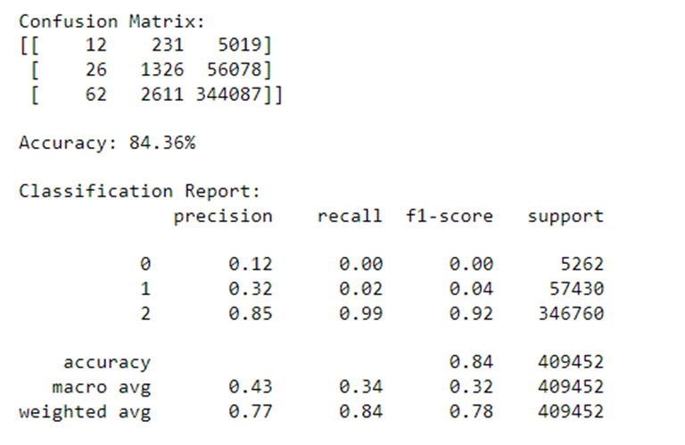

# Accident Fatality Prediction
### The whole project uses a dataset from kaggle named Acciden Information which is UK dataset of crashes that had ocurred previously.
### It consists Mainly Data filtering and Preprocessing Steps 
### The Random Forrest classifier and Logistic Regression model was choosen after reading about many models.
## About the project
<ul>
<li>
The main drive comes from the need to drastically lower traffic accidents and fatalities in an era where road safety is paramount.
</li>
<li>
The main goal was to create a reliable machine learning model that can accurately forecast crash fatalities.
</li>
<li>
This research involves developing prediction models, analyzing large amounts of traffic accident data, and assessing the models' efficiency.
</li>
</ul>

## Related Previous Works

## Analiyzing the Dataset

### Before

### After

## Model Training
### Random Forrest Model with Mean filled Data
#### Without feature Extraction
<ul>
<li>
Training data size=70%
</li>
<li>
Validation data size = 20%
</li>
<li>
Test data size=10%
</li>
<li>
Validation Accuracy: 84.45%
</li>
<li>
Testing Accuracy : 84.41%
</li>
</ul>

### Random Forrest Model With Mode filled Data
#### Without feature Extraction
<ul>
<li>
Training data size=80%
</li>
<li>
Test data size=20%
</li>
<li>
Testing Accuracy : 84.38%
</li>
</ul>

## Feature Extraction Sorted importance wise
### Before Feature Extraction

### After Feature Extraction

### Random Forrest Model with Mean filled Data
#### With feature Extraction
<ul>
<li>
Training data size=70%
</li>
<li>
Validation data size = 20%
</li>
<li>
Test data size=10%
</li>
<li>
Validation Accuracy: 84.45%
</li>
<li>
Testing Accuracy : 84.39%
</li>
</ul>

### Random Forrest Model with Mode filled Data
#### With feature Extraction

<ul>
<li>
Training data size=80%
</li>
<li>
Test data size=20%
</li>
<li>
Testing Accuracy : 84.36%
</li>
</ul>

## Results

## Future Scope
<ul>
<li>
Data Balancing
</li>
<li>
Using other algorithms to compare the results
</li>
<li>
Classifier optimization
<li>
More efficient Data Handling
</li>
</ul>

